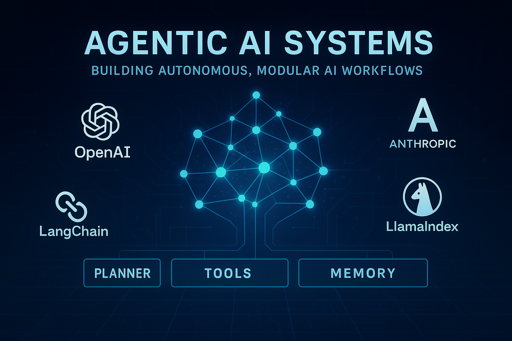

# 🤖 Agentic AI Systems

Welcome to **Agentic-AI-Systems** — a curated and evolving knowledge base for mastering Agentic and Generative AI system design!

---

## 📁 Repository Structure

### 1. [`/Gen-AI`](./content/Gen-AI/) 
Personal summaries of system design and evaluation overviews focused on generative AI: 
#### Gen-AI System Design Summaries

- [AI Engineering (by Huyen) Book Summary](./content/Gen-AI/AI-Engineering-Summary/README.md): Summarized insights from GenAI and agentic system engineering workflows.
- [GenAI Platform Overview (Huyen) Summary](./content/Gen-AI/huyen-Gen-AI-Platform.md): Technical architecture and features of Huyen’s GenAI platform.
- [Gen-AI Evaluation Framework (Huyen) Suammry](./content/Gen-AI/huyen-evaluation.md): Evaluation methodology and scoring with tools.
#### **Gen-AI API summaries**:
- [OpenAI API Summary (single page w/ examples)](./content/Agents/openai_api_quickstart.md): Get started fast with OpenAI’s API for generative tasks.

---
### 2. [`/Agents`](./content/Agents/)
Personal summaries which deep dive into agent architectures, SDKs, workflows, and orchestration strategies.

#### Agents System Design & Patterns
- [OpenAI Agents: Design Guide (Summary)](./content/Agents/openai-agents-design-guide.md): Design principles and structure for OpenAI agents.
- [LlamaIndex Multi-Agent System Design (Sumamry w/ examples)](./content/Agents/llama-index-multi-agent.md): Exploring multi-agent communication and delegation in LlamaIndex.
- [Anthropic's Build Effective Agents (Summary)](./content/Agents/anthropic-build_effective_agents.md): Techniques and best practices for building agents with Anthropic models.
- [Huyen Platform Agents Overview](./content/Agents/huyen-agents.md): Guide to using Huyen's agent framework.

#### Agentic Framework Summaries
- **OpenAI Agents SDK** Summaries: 
    - [**OpenAI Agents SDK** (Summary w/ examples)](./content/Agents/openai_agents_sdk.md): Comprehensive single-page SDK guide for building OpenAI-powered agents.
    - [OpenAI Agents (Concepts and Setup)](./content/Agents/openai-agents.md): Key concepts and basic setup for OpenAI agentic systems.
- [LlamaIndex Function Agent & Agent Workflow Summary](./content/Agents/llama-index-agent-workflow.md): Setup and execution of agent workflows using LlamaIndex.
- More coming soon...

<!-- #### Other -->

---
### 3. [`/Code`](./Code/README.md) (🚧 Coming Soon)
Hands-on starter code, examples, and small projects to accelerate your understanding and development of agentic systems.

<!-- | Resource | Description |
|---------|-------------|
| 🛠️ *Starter Templates* | Minimal codebases to bootstrap agentic systems using OpenAI, Anthropic, and LlamaIndex. |
| 🧪 *Experiments & Workflows* | Sample pipelines for task planning, multi-agent interaction, retrieval-augmented reasoning, and more. |
| 🎯 *Mini-Projects* | End-to-end demos integrating agents with external tools, APIs, or web interfaces. |
| 💡 *Design Patterns in Code* | Common system architecture patterns (e.g. planner-executor, tool-user agents). | -->

> 🔜 *Coming soon — contributions welcome!* You can start by forking and submitting your own code-based experiments.
---
### 4. References & Resources

- [Resources on Agents](./content/resources.md): Curated list of Agents system design frameworks, repos, courses, and key readings.
- [Agentic Frameworks & Tools](./content/stack-tools.md): Frameworks, tools, and SW stacks for building agentic systems, including: Agentic Frameworks, Embedding APIs, Vector DBs, UIs, and more.

---

<!-- ## 🚀 What You’ll Find Here

- 🤖 Design patterns for intelligent, agentic systems
- 🧠 Framework comparisons: OpenAI, Anthropic, LlamaIndex
- ⚙️ Modular workflows and pipeline code
- 📊 Evaluation techniques and benchmarks
- 🔗 Curated research summaries and toolkits -->

<!-- --- -->

## 🛠️ Contributing

Pull requests are welcome! If you'd like to add new frameworks, examples, or summaries, fork the repo and submit a PR.
